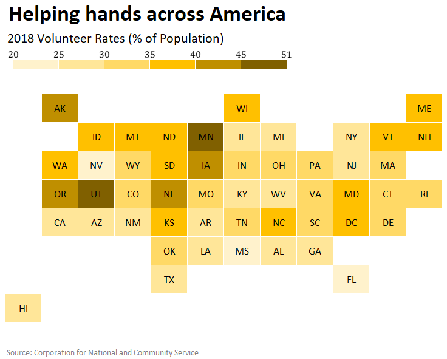

# portfolio
This is my public portfolio for the Telling Stories with Data course at Carnegie Mellon University!

# About me
Hello! My name is Ashita Vadlamudi (pronouns: she/her). I am a graduate student in the *Healthcare Analytics and Information Technology* program at Carnegie Mellon University. Prior to graduate school, I worked at the National Institutes of Health as a researcher studying the genetic basis of brittle bone disease. As an undergrad, I worked in other labs that conducted research on breast cancer and opioid addiction. Through these research projects, I have had the opportunity to work directly with data and various analytical tools to develop meaningful insights and drive future work. Following graduation, I hope to be working in consulting and learning more about different industries through hands-on projects. 

# What I hope to learn
Through this course, I hope to learn different data visualization techniques and tools to effectively and accurately convey the story behind numbers. I would also like to learn more about the design aspects of data visualization including choosing the right colors, fonts, spacing, etc. Furthermore, I would like to learn about the common pitfalls in data visualization and how to overcome them. 

# Portfolio

## Week 1
### Critique by redesign - Data visualization from Datawrapper
<iframe title="UK Political Trends: A Social Media Snapshot" aria-label="Bar Chart" id="datawrapper-chart-n8BkP" src="//datawrapper.dwcdn.net/n8BkP/6/" scrolling="no" frameborder="0" style="width: 0; min-width: 100% !important; border: none;" height="339"></iframe>

**Source:** “The Metamorphosis.” The Economist, August 13, 2016. [https://www.economist.com/britain/2016/08/13/the-metamorphosis](https://www.economist.com/britain/2016/08/13/the-metamorphosis)

**Few thoughts:**

The bar chart was an appropriate and effective choice in the original visualization posted in the article. I chose to maintain the same chart type for my redesign. With a few additional changes, I believe my proposed redesign is/has:
- Easier to read and understand because of the clear segmentation between candidates and political parties
- A more informative title
- Consistent typograhphy in labels

However, in both the original and my proposed redesign, it would have been more effective to display the percentage of likes out of the total number of posts made by each candidate / political party (although this would depend on what data is available). 

## Week 2
### Critique by redesign - Data visualization from Google Sheets

**Context:**
The original article was posted on The Economist. Apart from catching up on the major headlines each day, the audience of this news outlet enjoys reading about topics that provide them with additional general knowledge. In this case, the article’s goal is to assess if there is any truth to the phrase “Midwestern nice”. The authors show one measure of “niceness” through a map illustrating the volunteer rates across the U.S. 

**Note:** The dataset used to create the visualization in the original article showed 2017 volunteer rates. However, this data was no longer available. I used the 2018 volunteer rates and they followed the same trend as the previous year. 

**Sources:**
- "Is there any truth to the idea of “Midwestern nice”?" The Economist, December 27, 2018. [https://www.economist.com/graphic-detail/2018/12/27/is-there-any-truth-to-the-idea-of-midwestern-nice](https://www.economist.com/graphic-detail/2018/12/27/is-there-any-truth-to-the-idea-of-midwestern-nice)
- "State Rankings by Volunteer Rate" Corporation for National and Community Service, [https://www.nationalservice.gov/serve/via/rankings](https://www.nationalservice.gov/serve/via/rankings)

**Few thoughts:** 

The map was an appropriate and effective choice in the original visualization posted in the article. I chose to build off of this concept by redesigning the map and a few other changes including: 
- Equal sized squares for representing each state 
- A color gradient to represent the volunteer rate
- Consistent usage of state abbreviations as labels

As a result of these changes, I believe my proposed redesign: 
- improves upon the "truthfulness" scale - it is more accurate, valid, and reliable and does not misrepresent the underlying data
- effortless to understand
- simple yet aesthetically pleasing

### OIG Report Data Visualizations - Data visualization from Infogram
#### Perspective 1: Data journalist

**Audience:**

In this case, my audience consists of daily newsreaders of the NPR news outlet. This audience prefers to get a quick summary of the major headlines without too much unnecessary detail. They either listen to the news on TV or radio or read the daily headlines online. 

**Purpose:**

In this case, I chose to provide a brief overview of the crisis at the southern border. To help narrate the story, I chose to design two data visualizations. My goal is to make two key points: 
1) To show that this is due to high volume of apprehensions on the southern border
2) To show that there is overcrowding and prolonged detention at several Border Patrol facilities in the Rio Grande Valley

To make the first point, I chose a simple bar chart to show the increase in number of apprehensions between FY 2018 and FY 2019. I felt it was important to make this point to provide some background information on the current crisis. This information was originally presented in a table in the OIG report, however I felt it would be more effective to show it in a bar chart to help my audience “see” the increase rather than just read a few numbers. 

<iframe src="https://e.infogram.com/b1f3a37b-8308-428c-b880-f77b54a38765?src=embed" title="Sketch 1" width="450" height="450" scrolling="no" frameborder="0" style="border:none;" allowfullscreen="allowfullscreen"></iframe>
<a href="https://infogram.com/b1f3a37b-8308-428c-b880-f77b54a38765" style="color:#989898!important;text-decoration:none!important;" target="_blank">Copy: General Audience</a> <a href="https://infogram.com" style="color:#989898!important;text-decoration:none!important;" target="_blank" rel="nofollow">Infogram</a>

To make the second point, I chose an image and a doughnut chart to show the impact of the increase in the number of apprehensions. I used two visualizations: 1) An image from the original OIG report to illustrate overcrowding, and 2) A doughnut chart to show the total number of detainees and the percentage of people held for 72+ hours to illustrate prolonged detention. This information was presented in the text of the OIG report, but I felt it would be more effective to show the same information in a simple chart as it will help readers truly understand the scale and impact of the crisis.

<iframe src="https://e.infogram.com/4272d731-8f28-4808-8e8a-448f15356536?src=embed" title="Sketch 2" width="784" height="413" scrolling="no" frameborder="0" style="border:none;" allowfullscreen="allowfullscreen"></iframe>
<a href="https://infogram.com/4272d731-8f28-4808-8e8a-448f15356536" style="color:#989898!important;text-decoration:none!important;" target="_blank">Sketch 2</a> <a href="https://infogram.com" style="color:#989898!important;text-decoration:none!important;" target="_blank" rel="nofollow">Infogram</a>

In both cases, I chose simple data visualization types that would be familiar to my audience to help them quickly understand the information without spending much time. Additionally, I used descriptive yet simple titles for the charts to provide enough context and minimize text for explanations. In terms of color, I chose a lighter shade of green for the first chart as green is usually associated with upwards trends in data. For the second chart, I chose a brighter shade of red for the first chart to emphasize the urgency and importance of the situation.

#### Perspective 2: Data analyst working for Department of Human Services

**Audience:**

In this case, my audience consists of high-level policy analysts at DHS and other government agencies. This audience consists of experts who will understand technical terms and would like details.

**Purpose:**

In this case, I chose to recreate the table presented on page 2 of the original OIG report. The table is the first piece of data presented in the report and aims to convey two points: 1) There has been a significant increase in the number of apprehensions at the southwest border, and 2) This is mainly due to a rise in the number of family units that are illegally crossing the border. However, the gravity of the situation is lost as the table consists of many numbers, which the readers may not remember and potentially even skim through. Since many people are visual thinkers, I felt that representing the information in the table in the form of data visualizations would capture the reader's attention and effectively convey the importance and urgency of the crisis. 

In this case, I chose to design two simple visualizations to replace the table in the report.

<iframe src="https://e.infogram.com/1b4bafde-0756-4559-b2ce-1f51eb0e5d78?src=embed" title="Sketch 3" width="533" height="790" scrolling="no" frameborder="0" style="border:none;" allowfullscreen="allowfullscreen"></iframe>
<a href="https://infogram.com/1b4bafde-0756-4559-b2ce-1f51eb0e5d78" style="color:#989898!important;text-decoration:none!important;" target="_blank">Sketch 3</a> <a href="https://infogram.com" style="color:#989898!important;text-decoration:none!important;" target="_blank" rel="nofollow">Infogram</a>

As shown above, I chose a bubble chart to provide an aerial view of the crisis on southwest border - an increase in the total number of apprehensions between FY 2018 and FY 2019. For my second visualization, I chose a stacked bar chart to illustrate the breakdown of apprehensions by sector over the same time period. 

Both the data visualization types are familiar to my audience. I also used descriptive titles to capture and communicate the main point of each data visualization. In terms of color, I chose a gradient scheme for both visualizations with the darker shade indicating an increase in the number of apprehensions. 

**Source:** "OIG: DHS Needs to Address Dangerous Overcrowding and Prolonged Detention of Children and Adults in the Rio Grande Valley" U.S. Department of Homeland Security, July 2, 2019. [https://www.oig.dhs.gov/sites/default/files/assets/Mga/2019/oig-19-51-jul19.pdf](https://www.oig.dhs.gov/sites/default/files/assets/Mga/2019/oig-19-51-jul19.pdf)
