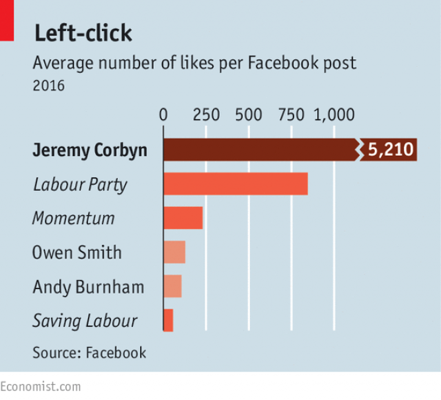
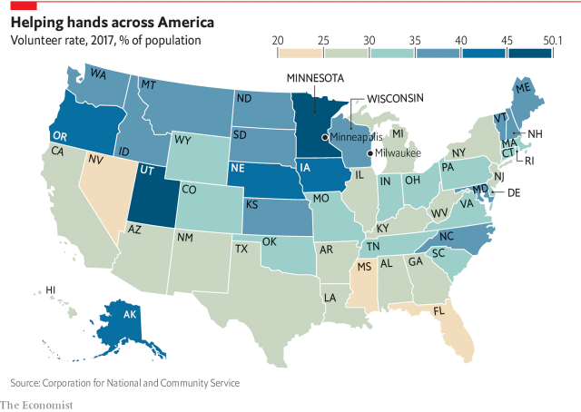

# portfolio
This is my public portfolio for the Telling Stories with Data course at Carnegie Mellon University!

# About me
Hello! My name is Ashita Vadlamudi (pronouns: she/her). I am a graduate student in the *Healthcare Analytics and Information Technology* program at Carnegie Mellon University. Prior to graduate school, I worked at the National Institutes of Health as a researcher studying the genetic basis of brittle bone disease. As an undergrad, I worked in other labs that conducted research on breast cancer and opioid addiction. Through these research projects, I have had the opportunity to work directly with data and various analytical tools to develop meaningful insights and drive future work. Following graduation, I hope to be working in consulting and learning more about different industries through hands-on projects. 

# What I hope to learn
Through this course, I hope to learn different data visualization techniques and tools to effectively and accurately convey the story behind numbers. I would also like to learn more about the design aspects of data visualization including choosing the right colors, fonts, spacing, etc. Furthermore, I would like to learn about the common pitfalls in data visualization and how to overcome them. 

# Portfolio

## Week 1
During week 1, I delivered a critique of a data visualization found in an article on The Economist about the political situation in the United Kingdom. Here’s a sneak peek of the original visualization.

 

**Source:** “The Metamorphosis.” The Economist, August 13, 2016. [https://www.economist.com/britain/2016/08/13/the-metamorphosis](https://www.economist.com/britain/2016/08/13/the-metamorphosis)

**Please follow [this link](/Week1.md) to read more about my critique and check out my redesign.**

## Week 2
During week 2, I was tasked with reviewing the [Management Alert](https://www.oig.dhs.gov/sites/default/files/assets/Mga/2019/oig-19-51-jul19.pdf) report published by the Office of the Inspector General regarding the ongoing crisis at the Immigration and Customs Enforcement facilities at the southwest border. Following this, I designed data visualizations to convey one key aspect of the report to two different audiences: 1) general newsreaders, and 2) policymakers and high-level government officials. 

I also delivered a critique of a separate data visualization about the truth behind the phrase “Midwestern nice”. In the original article published on The Economist, the authors assess volunteer rates across the United States to evaluate if there is any basis for this phrase. Here’s the original visualization.

 

**Source:** "Is there any truth to the idea of “Midwestern nice”?" The Economist, December 27, 2018. [https://www.economist.com/graphic-detail/2018/12/27/is-there-any-truth-to-the-idea-of-midwestern-nice](https://www.economist.com/graphic-detail/2018/12/27/is-there-any-truth-to-the-idea-of-midwestern-nice)

**Please follow [this link](/Week2.md) to read more about my critiques and redesigns for the week.**

## Week 3
