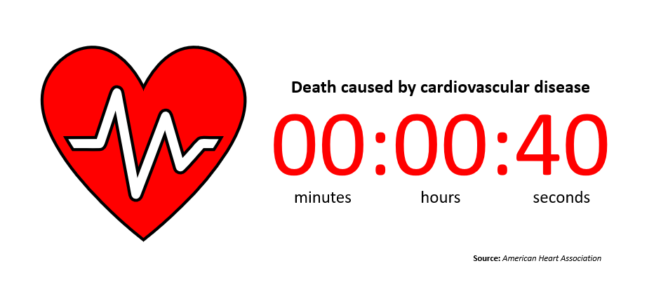

# Final Project
## Part I
### Section 1: Outline
**Potential Title:** Healthy diet, Healthier heart  
**Summary:** Cardiovascular disease is one of the top 5 leading causes of death in the United States. However, risk of developing the disease can be reduced by maintaining a healthy diet. 

**Project Structure:**  
**1)** Introduce major alarming statistic: Heart disease kills 1 person every 40 seconds.  
- Discuss heart disease prevalence by state  
- Zoom in on PA and emphasize that we have a relatively high prevalence

**2)** Discuss measures that can be taken to reduce risk of developing heart disease. 
- Briefly talk about article on NPR - Research shows that cutting 300 calories from your diet reduces your risk by x amount
- Show calorie consumption patterns in PA
- Show recommended federal guidelines for a healthy diet

**3)** Call to action
- Now don't get me wrong, I am not telling you to cut 300 calories from your daily diet. All I am asking you to do is to be more aware of what you put in your body at your next meal and every meal thereafter. 

### Section 2: Initial Sketches
#### Visualization 1: Facts & Figures

 

**Source:** "Heart disease and stroke statistics 2017 At-a-Glance" American Heart Association, 2017. [https://healthmetrics.heart.org/wp-content/uploads/2017/06/Heart-Disease-and-Stroke-Statistics-2017-ucm_491265.pdf](https://healthmetrics.heart.org/wp-content/uploads/2017/06/Heart-Disease-and-Stroke-Statistics-2017-ucm_491265.pdf)

#### Visualization 2: Heatmaps

<iframe src="https://e.infogram.com/8e041886-6646-4b3e-8467-1869bf3f8c3e?src=embed" title="Untitled slide project" width="1500" height="844" scrolling="no" frameborder="0" style="border:none;" allowfullscreen="allowfullscreen"></iframe>
<a href="https://infogram.com/8e041886-6646-4b3e-8467-1869bf3f8c3e" style="color:#989898!important;text-decoration:none!important;" target="_blank">Untitled slide project</a> <a href="https://infogram.com" style="color:#989898!important;text-decoration:none!important;" target="_blank" rel="nofollow">Infogram</a>

