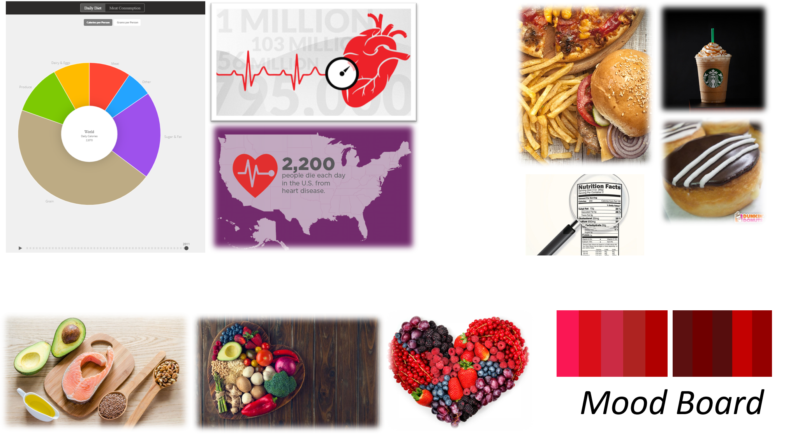

# Final Project - Part II

## Section 1 - Changes to final project

Last week, I created a few visualizations:

**1)** Statistic about cardiovascular disease prevalence  
**2)** A heat map showing prevalence of heart disease across the United States over time  
**3)** A range plot to show where our current diets stand relative to the recommendeded guidelines

**Note:** Access last week's updates [here](/final_project_Ashita.md). 

However, over the past week, I further contemplated the story I want to tell and thought about what *I* would want to learn if I was the audience and someone presented information about cardiovascular disease to me. It came down to 3 key points: 

**1)** What is the current status of disease prevalence? How significant is it?  
**2)** What have we been doing wrong that has led us here?  
**3)** How can we correct it?  

Once I broke it down, I realized that some of the data I collected and visualizations I created last week may not really add much value to my story. Here are the changes I made: 

**1)** I decided to no longer use the data about prevalence of heart disease across the United States - this is not the story I want to tell. I just need to know one piece of information to drive home the point that cardiovascular disease prevalence is high and I should be concerned. I felt the statistic graphic was sufficient for this purpose. 

**2)** I liked the idea of the range plot to show where we stand relative to what is recommended, but I had access to a limited amount of data which did not let me make appropriate and effective comparisons. Upon further research, I found data on total daily calorie consumption trends over the past 5 decades broken down by food group. I decided to use this data for my main visualizations (found on my Shorthand page). 

My updated data for the final project can be accessed [here](/FP_Data_Updated). 

**Sources:** 
"What the World Eats" National Geographic, [https://www.nationalgeographic.com/what-the-world-eats/](https://www.nationalgeographic.com/what-the-world-eats/)

## Section 2 - Wireframes & Storyboards
#### For this section of the project, I chose to begin building my story on Shorthand directly. Access my story [here](https://preview.shorthand.com/uC6eBRpQWEdTaCO0).

### Wireframes

I have 3 key visualizations along with several images of different foods to convey my story. 
**1)** Statistic about cardiovascular disease  
**2)** Bar chart showing trend in total daily calorie consumption in the United States over the past 5 decades  
**3)** Line graph showing the daily calorie breakdown by food group over the same time period

I additionally used imagery to quantify the "300 calories" and visually convey good versus bad foods towards the end of my story (see below for more details).

### Storyboard

**1)** My story starts off by engaging the audience through a bright and alarming statistic showing the prevalence of cardiovascular disease in the United States. 

**2)** Next, I take a step back to provide a little background as to what has actually led us to the current state by looking into overall calorie consumption and breakdown by food group. I believe this gets the audience to start thinking about their own diets and evaluate if it follows the trends shown in the visualizations. 
  
**3)** Then, I added some text to help recap the story so far and direct focus towards what we need to change to be more aligned with the recommended USDA guidelines for a balanced diet. 
    - I introduced the article by NPR which quoted a study that showed that you can reduce your risk of developing cardiovascular disease by cutting 300 calories from your diet as it helps reduce the associated risk factors such as cholesterol, weight, etc. 
    - I used common foods to help quantify "300 calories".
    
**4)** I added some text to transition to the the recommended USDA guidelines and provide tips for the audience with some imagery to help visually convey the message.

**5)** I conclude with my call to action - "Stop. Think. Eat." and also provide a link that leads to publicly available resources to help my audience become more aware of their diets and choose the right foods. 

## Section 3 - User Research

### Target Audience Persona
- I hope to reach anyone who is looking for tips and resources to help them reduce their risk of developing cardiovascular disease. This could be inviduals who are health conscious in general or those that have been cautioned by their doctors to closely watch their health due to existing medical signs that signal a risk of developing heart disease. While more elderly people might be interested in my story, I also hope to reach out to the younger population to help raise awareness and foster a healthier diet early on. 

### Interviewees
- I chose to reach out to people within my close network. I chose 3 older individuals and 2 younger individuals. Some of them were generally health conscious, while others did not really know much about the prevalence of cardiovascular disease and did not really consiously think about their diet in this sense. 

### Interview Script
- My approach to interviewing people was more open-ended and informal. I prepared a draft version of my Shorthand page covering most of the points on my Storyboard. I informed people about the main goal of the project. Without providing any information about my specific topic, I asked inviduals to just scroll through my Shorthand page and see if it tells them a story. 
- After receiving initial feedback, I typically asked them about any additional information they would have liked to see or any changes they would want me to make in terms of design / imagery / colors / visualizations to help make it easier to understand. 

### Findings: 
I summarized the findings from all my interviews by breaking them down into the following categories: 

#### Things to keep:
- The story flows and is simple to understand
- There is enough information provided and in layman's terms
- The page looks aesthetically pleasing and modern
- The link to the external resources page is a great way to avoid information overload on the site, instead leaving it up to the audience to decide if they want to learn more

#### Things to change: 
- Change the title of the initial graphic that shows the cardiovascular disease prevalence statistic *(implemented)*
- Axis titles need to be more descriptive
- Add tabs at the top of the page so you can easily navigate to different sections on the page *(implemented)*
- Consider adding a second axis to the line chart that shows the percent of total calorie consumption for each food category - helps show the change in proportion of intake over time
- The color of the "sugar and fat" line does not make sense - consider using red or other colors that help raise a flag
- Consider putting the two graphs side-by-side so I can immediately see what is contributing to the rise in total daily calorie consumption *(implemented)*
- Consider adding a graph with sugar/fat calories on one axis and serving size on the other in the "tips" section
- Add the labels directly to the line chart and remove the legend - then you can also you red as the color for the "sugar and fat" trend
- Add citations for all images

## Section 4 - Mood Board
- Most of my insipiration came from different images that represented the 3 topics I wanted to cover - cardiovascular disease facts, good foods, and bad foods. 

 

